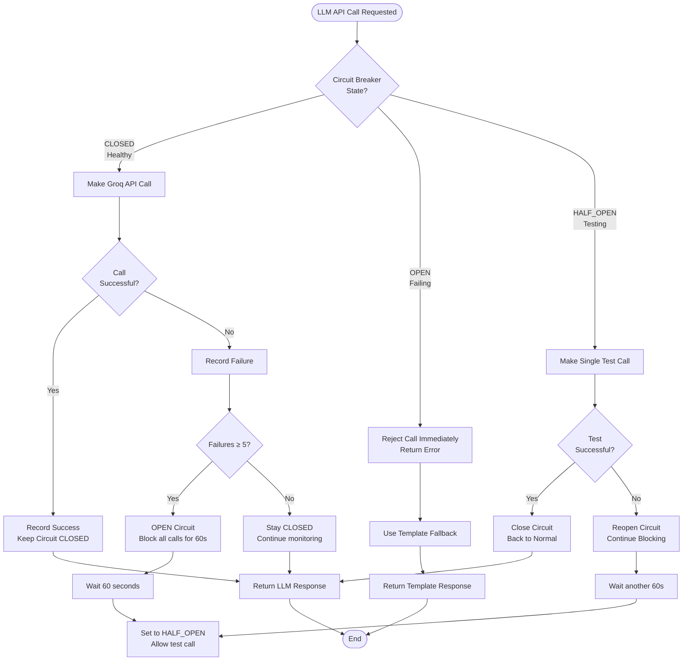
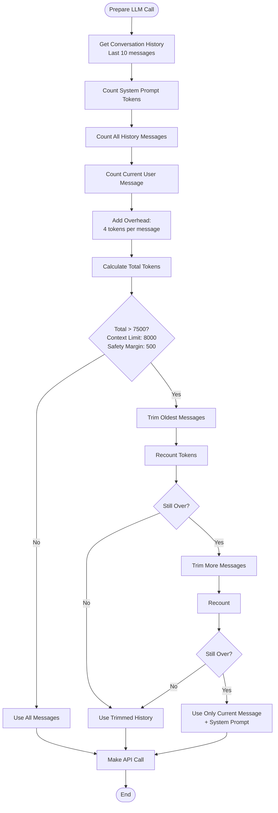
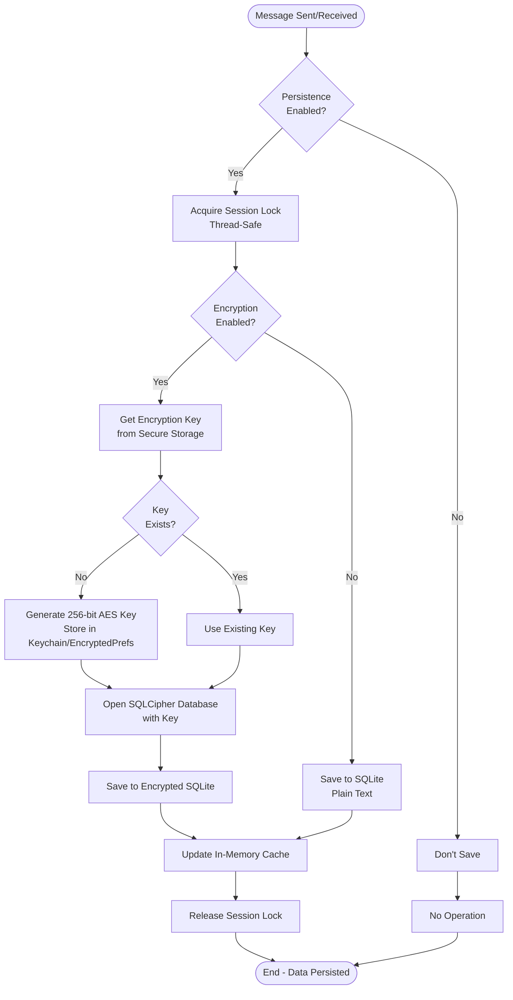

# StepSync ChatBot - All Conversation Flows
**Format: AI Diagram Maker Compatible**
**Date:** January 21, 2026

---

## Flow 1: Simple Greeting Flow (Template-Based)

```mermaid
flowchart TD
    Start([User Opens App]) --> Init[ChatBot Initialize]
    Init --> GreetMsg[Bot: "Hi! I'm Step Sync Assistant"]
    GreetMsg --> StatusCheck[Auto Check Tracking Status]
    StatusCheck --> UserGreet{User Says Hello/Hi}
    UserGreet --> BotGreet[Bot: Greeting Template Response]
    BotGreet --> QuickReplies[Show Quick Replies:<br/>- Check my status<br/>- Why aren't my steps syncing?]
    QuickReplies --> End([End - Await User Input])
```

**Description:** Basic greeting exchange using template responses
**Strategy:** Template (fast, no LLM)
**Triggers:** "hello", "hi", "hey", "good morning"

---

## Flow 2: Permission Grant Flow

```mermaid
flowchart TD
    Start([User Says "Grant Permission"]) --> Classify[Classify Intent:<br/>wantToGrantPermission]
    Classify --> CheckOS{Check Operating System}
    CheckOS -->|Android| AndroidFlow[Request Health Connect Permissions]
    CheckOS -->|iOS| iOSFlow[Request HealthKit Permissions]

    AndroidFlow --> Wait2s[Wait 2 seconds<br/>Health Connect Dialog]
    iOSFlow --> Wait500ms[Wait 500ms<br/>HealthKit Dialog]

    Wait2s --> GrantedAndroid{Permission Granted?}
    Wait500ms --> GrantediOS{Permission Granted?}

    GrantedAndroid -->|Yes| Success[Bot: "Great! Permissions granted"<br/>Update State]
    GrantedAndroid -->|No| Failed[Bot: "Permission denied" +<br/>Retry Quick Reply]

    GrantediOS -->|Yes| Success
    GrantediOS -->|No| Failed

    Success --> NextCheck[Check Data Sources]
    Failed --> End([End])
    NextCheck --> End
```

**Description:** Handles permission request flow with platform-specific logic
**Strategy:** Template (system-level operation)
**Triggers:** "grant permission", "allow access", quick reply button

---

## Flow 3: Comprehensive Diagnostic Check Flow

```mermaid
flowchart TD
    Start([User Says "Check Status"]) --> Classify[Classify Intent:<br/>checkingStatus]
    Classify --> StartMsg[Bot: "Let me run comprehensive diagnostic"]
    StartMsg --> SetDiagnosing[Set Status: Diagnosing]
    SetDiagnosing --> RunDiag[Run Diagnostic Service]

    RunDiag --> CheckPlatform[Check Platform Availability]
    CheckPlatform --> CheckPerm[Check Permissions]
    CheckPerm --> CheckBattery[Check Battery Optimization<br/>Android Only]
    CheckBattery --> CheckSources[Check Data Sources]
    CheckSources --> CheckData[Get Recent Step Data]

    CheckData --> CollectIssues[Collect All Issues]
    CollectIssues --> FormatReport[Format Diagnostic Report]
    FormatReport --> SendReport[Bot: Send Diagnostic Report]

    SendReport --> HasIssues{Has Actionable Issues?}
    HasIssues -->|Yes| OfferActions[Bot: "What would you like to do?"<br/>+ Quick Reply Buttons]
    HasIssues -->|No| NoActions[Bot: "No issues found"<br/>No Quick Replies]

    OfferActions --> UpdateState[Update ChatBot State:<br/>- permissionState<br/>- dataSources<br/>- recentStepData]
    NoActions --> UpdateState

    UpdateState --> SetIdle[Set Status: Idle]
    SetIdle --> End([End])
```

**Description:** Full system health check with detailed reporting
**Strategy:** Template (diagnostic operation)
**Duration:** ~2-5 seconds
**Triggers:** "check status", "run diagnostic", "how is my setup"

---

## Flow 4: Steps Not Syncing (LLM-Enhanced)

```mermaid
flowchart TD
    Start([User: "My steps aren't syncing"]) --> Classify[Classify Intent:<br/>stepsNotSyncing]
    Classify --> AddContext[Add to Conversation Context:<br/>- Intent<br/>- Sentiment]

    AddContext --> CheckLLM{LLM Enabled?}
    CheckLLM -->|No| TemplateOnly[Use Template Response]
    CheckLLM -->|Yes| SelectStrategy[Response Strategy Selector]

    SelectStrategy --> CheckSentiment{User Frustrated?}
    CheckSentiment -->|Yes| UseLLM[Strategy: LLM]
    CheckSentiment -->|No| CheckConfidence{Intent Confidence}

    CheckConfidence -->|Low <0.85| UseLLM
    CheckConfidence -->|High ≥0.85| CheckTurns{Turn Count}

    CheckTurns -->|>3 turns| UseLLM
    CheckTurns -->|≤3 turns| UseHybrid[Strategy: Hybrid]

    UseLLM --> RunDiagForLLM[Run Diagnostics for Context]
    UseHybrid --> RunDiagForHybrid[Run Diagnostics for Context]

    RunDiagForLLM --> SanitizePHI[Sanitize PHI from Input]
    RunDiagForHybrid --> GetTemplate[Get Template Message]

    SanitizePHI --> CountTokens[Count Tokens<br/>Check Limit]
    GetTemplate --> SanitizePHI2[Sanitize PHI]

    CountTokens --> BuildPrompt[Build System Prompt:<br/>- Sentiment tone<br/>- Conversation history<br/>- Diagnostic results]
    SanitizePHI2 --> CountTokens2[Count Tokens]

    BuildPrompt --> CallGroq[Call Groq API<br/>llama3-70b-8192]
    CountTokens2 --> BuildEnhancement[Build Enhancement Prompt]

    BuildEnhancement --> CallGroqHybrid[Call Groq API<br/>for Enhancement]

    CallGroq --> CircuitBreaker{Circuit Breaker<br/>Open?}
    CallGroqHybrid --> CircuitBreaker2{Circuit Breaker<br/>Open?}

    CircuitBreaker -->|Open| FallbackTemplate[Fallback to Template]
    CircuitBreaker -->|Closed| GetResponse[Get LLM Response]

    CircuitBreaker2 -->|Open| UseTemplateOnly[Use Template Only]
    CircuitBreaker2 -->|Closed| GetEnhancement[Get Enhancement]

    GetResponse --> SendLLMMsg[Bot: Natural LLM Response]
    GetEnhancement --> MergeTemplate[Merge Enhancement into Template]

    MergeTemplate --> SendHybridMsg[Bot: Enhanced Template]
    TemplateOnly --> SendTemplateMsg[Bot: Template Response]
    FallbackTemplate --> SendTemplateMsg
    UseTemplateOnly --> SendTemplateMsg

    SendLLMMsg --> OfferQuickReplies{Should Offer<br/>Quick Replies?}
    SendHybridMsg --> OfferQuickReplies
    SendTemplateMsg --> OfferQuickReplies

    OfferQuickReplies -->|Yes| AddReplies[Add Contextual Quick Replies]
    OfferQuickReplies -->|No| UpdateContext[Update Conversation Context]

    AddReplies --> UpdateContext
    UpdateContext --> SaveConv[Save to Encrypted DB]
    SaveConv --> End([End])
```

**Description:** Intelligent routing between template, LLM, and hybrid responses
**Strategy:** Dynamic (Template/LLM/Hybrid based on context)
**Cost:** $0-$0.002 per conversation
**Triggers:** "steps not syncing", "not tracking", "data missing"

---

## Flow 5: Frustrated User Flow (Always LLM)

```mermaid
flowchart TD
    Start([User: "This is so frustrating!!!"]) --> DetectSentiment[Detect Sentiment:<br/>VERY_FRUSTRATED]
    DetectSentiment --> ClassifyIntent[Classify Intent]
    ClassifyIntent --> ForceStrategy[Force Strategy: LLM<br/>Regardless of intent]

    ForceStrategy --> BuildEmpathetic[Build Empathetic System Prompt:<br/>"User is frustrated, respond with<br/>empathy and understanding"]

    BuildEmpathetic --> AddHistory[Add Full Conversation History<br/>Last 10 messages]
    AddHistory --> RunDiag[Run Relevant Diagnostics]
    RunDiag --> SanitizePHI[Sanitize PHI]
    SanitizePHI --> CallGroq[Call Groq API<br/>With Empathetic Prompt]

    CallGroq --> GetNaturalResponse[Get Natural,<br/>Empathetic Response]
    GetNaturalResponse --> SendMsg[Bot: Empathetic LLM Response]
    SendMsg --> OfferHelp[Offer Specific Help Actions]
    OfferHelp --> UpdateContext[Update Context:<br/>sentiment = frustrated]
    UpdateContext --> End([End])
```

**Description:** Special handling for frustrated users with guaranteed LLM empathy
**Strategy:** Always LLM (even for simple intents)
**Triggers:** Sentiment detection (exclamations, strong negatives)
**Examples:** "This sucks!!!", "Why doesn't this work?!", "Annoying!"

---

## Flow 6: Multi-Turn Context-Aware Conversation

```mermaid
flowchart TD
    Start([Turn 1: User: "I use Samsung Health"]) --> Turn1[Bot: Acknowledges]
    Turn1 --> UpdateContext1[Context:<br/>- mentionedApp = samsung health<br/>- turns = 1]

    UpdateContext1 --> Turn2Start([Turn 2: User: "It's not syncing"])
    Turn2Start --> ResolveReference[Resolve "It" → Samsung Health]
    ResolveReference --> Strategy2[Select Strategy: LLM<br/>Multi-turn conversation]

    Strategy2 --> BuildContext2[Build Prompt with:<br/>- "User uses Samsung Health"<br/>- "Samsung Health not syncing"<br/>- Previous 2 messages]

    BuildContext2 --> LLMResponse2[LLM: Natural response about<br/>Samsung Health syncing]
    LLMResponse2 --> UpdateContext2[Context:<br/>- mentionedApp = samsung health<br/>- currentProblem = syncing<br/>- turns = 2]

    UpdateContext2 --> Turn3Start([Turn 3: User: "What should I do?"])
    Turn3Start --> UsePrevContext[Use Full Context:<br/>- App: Samsung Health<br/>- Problem: Syncing<br/>- Turn count: 3]

    UsePrevContext --> LLMResponse3[LLM: Specific troubleshooting<br/>for Samsung Health syncing]
    LLMResponse3 --> OfferActions[Offer Quick Actions:<br/>- Check permissions<br/>- Restart Samsung Health<br/>- Contact support]

    OfferActions --> End([End])
```

**Description:** Multi-turn conversation with context tracking and pronoun resolution
**Strategy:** LLM (complex context required)
**Features:** Reference tracking, app mention tracking, problem tracking
**Limit:** Keeps last 10 messages in context

---

## Flow 7: Install Health Connect Flow

```mermaid
flowchart TD
    Start([User Clicks "Install Health Connect"<br/>Quick Reply]) --> RouteAction[Route Action:<br/>install_health_connect]
    RouteAction --> SendMsg1[Bot: "Opening Google Play Store..."]
    SendMsg1 --> TryOpen[Try PlatformUtils.openHealthConnectPlayStore]

    TryOpen --> Opened{Successfully<br/>Opened?}
    Opened -->|Yes| NoFallback[No additional message]
    Opened -->|No| SendFallback[Bot: "Could not open Play Store<br/>automatically. Please search<br/>for 'Health Connect'"]

    NoFallback --> End([End - User in Play Store])
    SendFallback --> End2([End - User must manual search])
```

**Description:** Handles deep linking to Health Connect in Play Store
**Strategy:** System action
**Platform:** Android only
**Fallback:** Manual instructions if deep link fails

---

## Flow 8: Battery Optimization Settings Flow

```mermaid
flowchart TD
    Start([User Clicks "Fix Battery Optimization"]) --> RouteAction[Route Action:<br/>open_battery_settings]
    RouteAction --> SendMsg1[Bot: "Opening battery settings...<br/>Find this app and disable<br/>battery optimization"]

    SendMsg1 --> TryOpen[Try PlatformUtils.openBatteryOptimizationSettings]
    TryOpen --> Opened{Successfully<br/>Opened?}

    Opened -->|Yes| NoFallback[No additional message]
    Opened -->|No| SendFallback[Bot: "Could not open settings<br/>automatically. Please go to:<br/>Settings > Apps > [This App] ><br/>Battery > Unrestricted"]

    NoFallback --> End([End - User in Settings])
    SendFallback --> End2([End - Manual instructions])
```

**Description:** Opens battery optimization settings with fallback instructions
**Strategy:** System action
**Platform:** Android only
**Issue Detection:** Flagged when background sync is limited

---

## Flow 9: Privacy/PHI Sanitization Flow (Background)

```mermaid
flowchart TD
    Start([User Input Received]) --> CheckLLM{Will use LLM?}
    CheckLLM -->|No| SkipSanitization[Skip Sanitization<br/>Local processing only]
    CheckLLM -->|Yes| RunSanitizer[Run PHISanitizerService]

    RunSanitizer --> DetectPHI[Detect PHI:<br/>- Email addresses<br/>- Phone numbers<br/>- Dates<br/>- Names<br/>- Device identifiers]

    DetectPHI --> HasPHI{PHI Detected?}
    HasPHI -->|No| PassThrough[Pass original text]
    HasPHI -->|Yes| Sanitize[Replace PHI with placeholders:<br/>- EMAIL_REDACTED<br/>- PHONE_REDACTED<br/>- DATE_REDACTED<br/>- NAME_REDACTED<br/>- DEVICE_REDACTED]

    Sanitize --> LogDetection[Log PHI detection<br/>(not the actual PHI)]
    LogDetection --> SendSanitized[Send sanitized text to LLM]
    PassThrough --> SendOriginal[Send original text to LLM]
    SkipSanitization --> UseOriginal[Process locally]

    SendSanitized --> End([LLM Never Sees PHI])
    SendOriginal --> End
    UseOriginal --> End2([No External API Call])
```

**Description:** Automatic PHI detection and sanitization before LLM calls
**Strategy:** Privacy protection (HIPAA compliance)
**Always Active:** When LLM is enabled
**Zero Trust:** Assumes all user input might contain PHI

---

## Flow 10: Circuit Breaker Pattern (Error Resilience)



**Description:** Prevents cascade failures when Groq API is down/slow
**Strategy:** Automatic failover to templates
**Configuration:** 5 failures opens circuit, 60s timeout, 2 successes closes
**Impact:** Graceful degradation, no user-facing errors

---

## Flow 11: Token Counting & Context Management



**Description:** Ensures API calls never exceed context window limits
**Strategy:** Intelligent message trimming
**Model:** llama3-70b-8192 (8000 token context)
**Safety:** 500 token margin for response

---

## Flow 12: Conversation Persistence Flow (Background)



**Description:** Automatic conversation persistence with encryption
**Strategy:** HIPAA-compliant encrypted storage
**Platform Security:** iOS Keychain, Android EncryptedSharedPreferences, Windows Credential Manager
**Concurrency:** Thread-safe with per-session locks

---

## Flow 13: Offline Mode Flow

```mermaid
flowchart TD
    Start([User Input Received]) --> CheckNetwork[Check Network Connectivity]
    CheckNetwork --> IsOnline{Internet<br/>Available?}

    IsOnline -->|Yes| NormalFlow[Use Normal Flow<br/>LLM Available]
    IsOnline -->|No| OfflineMode[Enter Offline Mode]

    OfflineMode --> CheckIntent[Classify Intent Locally]
    CheckIntent --> ForceTemplate[Force Template Strategy<br/>No LLM Available]

    ForceTemplate --> UseLocal[Use Local Diagnostics Only]
    UseLocal --> QueueMessage{Should Queue<br/>for Sync?}

    QueueMessage -->|Yes| AddToQueue[Add to Offline Queue]
    QueueMessage -->|No| JustRespond[Just Respond]

    AddToQueue --> SendTemplate[Send Template Response +<br/>"You're offline" notice]
    JustRespond --> SendTemplate

    SendTemplate --> SaveLocal[Save to Local DB Only<br/>No cloud sync]

    SaveLocal --> MonitorNetwork[Monitor for Reconnection]
    MonitorNetwork --> Reconnected{Network<br/>Restored?}

    Reconnected -->|Yes| SyncQueue[Sync Queued Messages]
    Reconnected -->|No| StayOffline[Stay in Offline Mode]

    SyncQueue --> ClearQueue[Clear Offline Queue]
    NormalFlow --> End([End])
    StayOffline --> End
    ClearQueue --> End
```

**Description:** Graceful degradation when internet unavailable
**Strategy:** Local-only template responses
**Features:** Message queuing, automatic sync on reconnect
**User Notice:** "You're offline - limited functionality"

---

## Flow 14: Voice Input Flow

```mermaid
flowchart TD
    Start([User Taps Microphone Button]) --> CheckPerm{Has Microphone<br/>Permission?}
    CheckPerm -->|No| RequestPerm[Request Microphone Permission]
    CheckPerm -->|Yes| InitRecognizer[Initialize Speech Recognizer]

    RequestPerm --> PermGranted{Permission<br/>Granted?}
    PermGranted -->|No| ShowError[Show Error:<br/>"Microphone permission required"]
    PermGranted -->|Yes| InitRecognizer

    InitRecognizer --> StartListening[Start Listening<br/>Show Visual Feedback]
    StartListening --> Listening[Listening for Speech...]

    Listening --> SpeechDetected{Speech<br/>Detected?}
    SpeechDetected -->|No - Timeout| StopAuto[Stop Automatically<br/>After 5 seconds]
    SpeechDetected -->|Yes| Convert[Convert Speech to Text<br/>Streaming]

    Convert --> ShowLive[Show Live Transcription<br/>As User Speaks]
    ShowLive --> UserStops{User Stops<br/>Speaking?}

    UserStops -->|No| Continue[Continue Listening]
    UserStops -->|Yes| Finalize[Finalize Transcription]

    Continue --> SpeechDetected
    Finalize --> HasText{Text<br/>Generated?}

    HasText -->|Yes| FillInput[Fill Text Input<br/>Allow user to edit]
    HasText -->|No| ShowNoSpeech[Show "No speech detected"]

    FillInput --> UserReview[User Can Edit/Send]
    UserReview --> SendText{User Sends?}

    SendText -->|Yes| ProcessNormal[Process as Normal Text Input]
    SendText -->|No| Discard[Discard Voice Input]

    StopAuto --> ShowNoSpeech
    ShowError --> End([End])
    ShowNoSpeech --> End
    ProcessNormal --> End
    Discard --> End
```

**Description:** Voice-to-text input with permission handling
**Platform:** Uses native speech recognition (iOS/Android)
**Features:** Live transcription, edit before send, auto-timeout
**Permission:** Requires microphone permission

---

## Summary Statistics

| Flow Type | Count | LLM Usage | Avg Duration |
|-----------|-------|-----------|--------------|
| Template-Only | 6 | Never | <1s |
| LLM-Enhanced | 3 | Always | 2-5s |
| Hybrid | 1 | Conditional | 1-3s |
| System Action | 3 | Never | 1-2s |
| Background Process | 4 | N/A | Continuous |

**Total Conversation Paths:** 14
**Total User Intents Supported:** 20+
**Response Strategies:** 3 (Template, LLM, Hybrid)
**Privacy Protection:** Always active
**Error Handling:** Circuit breaker + fallbacks
**Offline Support:** Full template functionality

---

## Key Decision Points

1. **LLM vs Template:** Based on sentiment, confidence, turn count
2. **Privacy First:** Always sanitize before external API
3. **Resilience:** Circuit breaker prevents cascade failures
4. **Cost Optimization:** Template when possible, LLM when needed
5. **User Experience:** Graceful degradation, never crash
6. **HIPAA Compliance:** Encrypted storage, PHI sanitization
7. **Context Awareness:** Track apps, problems, references
8. **Platform Specific:** Handle iOS/Android differences

---

**Ready for AI Diagram Maker:**
- Each flow uses Mermaid syntax
- Clear decision points marked with diamonds
- All paths lead to defined endpoints
- Annotations explain key logic
- Can generate flowcharts, sequence diagrams, or state machines

**Usage Instructions for AI Diagram Tools:**
1. Copy individual flow sections
2. Paste into Mermaid-compatible tools (Mermaid Live, Draw.io, PlantUML)
3. Or use AI diagram generators that understand flowchart markdown
4. Each flow is self-contained and can be rendered independently
